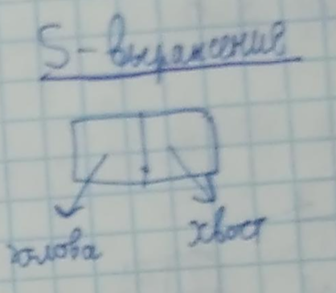
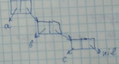

=============================
Языки программирования, 2017г
=============================

Лекция 1
========

Курс начал читаться в 1983 г. Роль ЯП в скиллах программиста падает (мнение
лектора может не совпадать с реальностью, авторский текст сохранен).
Первый ЯП высокого уровня - FORTRAN (formula translator, 1954-1957). FORTRAN
позволил избавиться от привязки программы к конкретной машине.

Что нужно знать программисту кроме C++?

+ Компилятор
+ Текстовый редактор
+ Отладчик
+ Стандартная библиотека

Дополнительные инструменты:

+ git, SVN
    Системы контроля версий
+ JIRA
    Система управления проектом (система контроля за проектом), подробнее - jira_
+ CI (Continuous Integration)
    практика разработки ПО, в которой члены команды проводят интеграцию не реже чем раз в день. Результаты
    интеграции проверяются автоматически, обычно используя автотесты и
    статический анализ кода.
+ SCRUM
    спринты (демонстрация работы команды) каждые 1-2 недели,
    подробнее - scrum_

.. _jira: https://ru.atlassian.com/software/jira
.. _scrum: https://ru.atlassian.com/agile/scrum

Парадигмы программирования
--------------------------

1. Императивная (Фон-Неймановская)
2. Функциональная
3. Логическая
4. ООП

..  _imperative::

Императивная парадигма
''''''''''''''''''''''

Принципы Фон-Неймана

+ Память - линейная, однородная
+ Состояние (программы?) определяется памятью
+ S1 → S2: Оператор меняет состояние, операция вычисляет выражение
+ Языки высокого уровня структурируют данные и вводят операции над ними.
+ Основной оператор в это парадигме - присваивание ( := )
+ В языке ассемблера mov -- классическая и самая основная инструкция присваивания.
+ Кроме присваивания существует еще некоторый набор операций.

Функциональная парадигма (я слаб в ней, чекните)
'''''''''''''''''''''''''''''''''''''''''''''''

Основа -- вычисление функций -- f(a, b) .
У них (функций?) нет состояний.
Доказывать свойство программы просто

.. math:: Q_1 <= ... <= P <= ... <= Q_2

где Q_1, Q_2 - предикат входных данных и предикат результата. 

Подробнее:

+ `Основы функционального программирования`_
+ `Выявление и доказательство свойств функциональных программ методами суперкомпиляции`_

FP — первый функциональный ЯП (ну хоть его мы не учим)
Фон-Неймановские (императивные) программы тяжело распараллеливать (возможно, ФП — легко, не уверен)

.. _Основы функционального программирования: https://ru.wikibooks.org/wiki/%D0%9E%D1%81%D0%BD%D0%BE%D0%B2%D1%8B_%D1%84%D1%83%D0%BD%D0%BA%D1%86%D0%B8%D0%BE%D0%BD%D0%B0%D0%BB%D1%8C%D0%BD%D0%BE%D0%B3%D0%BE_%D0%BF%D1%80%D0%BE%D0%B3%D1%80%D0%B0%D0%BC%D0%BC%D0%B8%D1%80%D0%BE%D0%B2%D0%B0%D0%BD%D0%B8%D1%8F/%D0%94%D0%BE%D0%BA%D0%B0%D0%B7%D0%B0%D1%82%D0%B5%D0%BB%D1%8C%D1%81%D1%82%D0%B2%D0%BE_%D1%81%D0%B2%D0%BE%D0%B9%D1%81%D1%82%D0%B2_%D1%84%D1%83%D0%BD%D0%BA%D1%86%D0%B8%D0%B9

.. _Выявление и доказательство свойств функциональных программ методами суперкомпиляции: http://www.dissercat.com/content/vyyavlenie-i-dokazatelstvo-svoistv-funktsionalnykh-programm-metodami-superkompilyatsii

Логическое программирование
'''''''''''''''''''''''''''

`Математическая логика и логическое программирование`_

.. _Математическая логика и логическое программирование: http://mk.cs.msu.ru/index.php/%D0%9C%D0%B0%D1%82%D0%B5%D0%BC%D0%B0%D1%82%D0%B8%D1%87%D0%B5%D1%81%D0%BA%D0%B0%D1%8F_%D0%BB%D0%BE%D0%B3%D0%B8%D0%BA%D0%B0_%D0%B8_%D0%BB%D0%BE%D0%B3%D0%B8%D1%87%D0%B5%D1%81%D0%BA%D0%BE%D0%B5_%D0%BF%D1%80%D0%BE%D0%B3%D1%80%D0%B0%D0%BC%D0%BC%D0%B8%D1%80%D0%BE%D0%B2%D0%B0%D0%BD%D0%B8%D0%B5_(3-%D0%B9_%D0%BF%D0%BE%D1%82%D0%BE%D0%BA)

ООП
'''

ООП - объектно-ориентированное программирование, это надстройка над `Императивной парадигмой`_. (содержательно, согласен)

Основа ООП - объект.
Объект - экземпляр некоторого класса.
У объекта скрыта внутренняя реализация (черный ящик, сокрытие деталей).
Он может посылать сообщения другим объектам и определенным образом
реагировать на сообщения сам.
Подробнее — `Объектно-ориентированное программирование`_

.. _Императивной парадигмой: `Императивная парадигма`_

.. _Объектно-ориентированное программирование: https://ru.wikipedia.org/wiki/%D0%9E%D0%B1%D1%8A%D0%B5%D0%BA%D1%82%D0%BD%D0%BE-%D0%BE%D1%80%D0%B8%D0%B5%D0%BD%D1%82%D0%B8%D1%80%D0%BE%D0%B2%D0%B0%D0%BD%D0%BD%D0%BE%D0%B5_%D0%BF%D1%80%D0%BE%D0%B3%D1%80%D0%B0%D0%BC%D0%BC%D0%B8%D1%80%D0%BE%D0%B2%D0%B0%D0%BD%D0%B8%D0%B5

Лекция 2
========

Парадигма программирования =/ Язык программирования

Деятельность программирования:

#. Игровое программирование
    прогр-е для себя. В ЯП главное, чтобы программисту нравилось (?). Пример - BASIC​ (???)

#. “Научное” программирование 
    прогр-е для себя и узкого круга коллег. Главное - результат. 
    Пример ЯП - Perl​ (изначально создан для этого, потом стал промышленным).
    Средства - sed, awk (ну так сюда хоть bash пихай, хз зачем это тут)

#. Индустриальное программирование  
    написание программ для последующего их использования в отрыве от программиста. 
    ТП - технологическая потребность
    КТП - критическая ТП 
    Модульность - это КТП для ЯП здесь.
    Пример - FORTRAN​

Всякие разные ЯПы
-----------------

+ PL/1 (IBM)
+ Algol 68 
    На его основе был создан С (но это не точно)
+ Pascal
+ Ada - был признан военным стандартом
    ЯП для систем реального времени (в боевых действиях).
    Требования - надежность, устойчивость (к отказам), ...
+ Modula-2
    Был нацелен на системное ПО, сейчас в эту нишу занял С.
+ GNAT 
    GNU NYU Ada Translator
    
Курс изначально был основан на языке Ada.

Основные выводы
---------------

ЯП не внедряются, а выживают. Предсказать это нельзя. Выживают, как правило, те
ЯП, которые придумывает один человек.
Язык должен быть достаточно прост (при обучении первые программы должны
появляться на 1-2 день)
Нет и не будет никогда единого ЯП.
Задача для индустриального ЯП:
<stdin> => [reverse] => <stdout>.
C:
<прога, которая реверсит stdin, не благодарите>
Недостаток этой программы - статическое распределение памяти, писать не очень
удобно.

Лекция 3
========

Беда использования realloc() - фрагментация памяти.
Работа с динамической памятью - тонкая вещь.
Modula-2​ -> Oberon ​- 10 стр. описание языка (?).
ЯП был нацелен на системное программирование (СП). Первый СП-ЯП со сборкой
мусора. Компилятор ЯП Oberon на Oberon - 4k строк.

Принципы выбора функциональности ЯП:

+ Принцип сундука - берем все, что нужно (что может понадобиться)
+ Принцип <...> - берем все, без чего ЯП (наверное) не имеет смысла.

Go - язык с динамической сборкой мусора.  
Объявления в Go: 

::

    var <name> <type> [ = <value> ]
    
Можно иначе, без явного указания типа:

::

    <name> := <value>

Вспомним задачу <stdin> => [reverse] => <stdout>.

Решение на Go:

.. code-block:: golang

    package main;

    import (
        "bufio"
        "fmt"
        "os"
    )

    func Reverse(s string) string {
        runes := []rune(s)
        for i, j := 0, len(runes)-1; i < j; i, j = i+1, j-1 {
            runes[i], runes[j] = runes[j], runes[i]
        }
        return string(runes)
    }

    func main() {
        reader := bufio.NewReader(os.Stdin)
        fmt.Print("Enter string: ")
        text, _ := reader.ReadString('\n')
        fmt.Println(Reverse(text))
    }

    
Решение на C#:

.. code-block:: csharp
    
    using System;

    class MainClass {
      public static void Main (string[] args) {
        string input = Console.ReadLine();

        char[] inputarray = input.ToCharArray();
        Array.Reverse(inputarray);
        string output = new string(inputarray);

        Console.WriteLine (output);
      }
    }

Решение на Python (`How to Slice Lists/Arrays and Tuples in Python`_):

.. code-block:: python

    import sys
    print(input()[::-1])
    
.. _How to Slice Lists/Arrays and Tuples in Python: https://www.pythoncentral.io/how-to-slice-listsarrays-and-tuples-in-python/

Лекция 4
========

Язык С++
--------

generic (обобщенное) программирование - шаблоны (параметрический полиморфизм)
в Python, JS его нет и быть не может (бред какой-то, как же тогда type hints работают? зачем тогда весь модуль typing?)

Решение задачи на C++:

.. code-block:: c++

    #include <iostream>
    #include <string>

    std::string reversed(const std::string& s) {
      std::string reversed_s;
      for(auto it = s.rbegin(); it != s.rend(); it++ ) {
          reversed_s.push_back(*it);
      } 
      return reversed_s;
    }

    int main()
    {
        std::string v;
        std::cout << "Type a string: ";
        std::cin >> v;
        std::cout << "Reversed: " << reversed(v) << std::endl;
        return 0;
    }

    
Функциональное программирование
-------------------------------

Точка рассмотрения ЯП:

+-------------------------------------------------+
|                      Базис                      |
+------------------------+------------------------+
| Скалярный базис        | Структурный базис      |
+------------------------+------------------------+
| Встроенные типы        | Составные типы данных, |
| и операции, операторы, | массивы, структуры,    |
| выражения              | составные операторы    |
+------------------------+------------------------+

LISP ( “Чистый” LISP). LISP - List Processing.
(LISP не знаю, переписываю с лекций, чекните & поправьте если что)

У LISP крайне простой базис (правила):

+ Типы данных
    
    (атом) -> (символ, т.е. идентификатор ) | (целое число)
    
+ Средство развития: 
    
    (S - выражение) -> (голова)(хвост)
    
+ Шаг вычисления

    число вычисляется само в себя
    
+ Список
       
    частный случай S-выражения

Иллюстрации: 

|s-выражение head-tail| |s-выражение 3 items|

    

.. image:: https://g.gravizo.com/source/trygraph?https://raw.githubusercontent.com/grihabor/plangs/master/README.rst)

::

    
 
    

    trygraph
      digraph G {
        aize ="4,4";
        main [shape=box];
        main -> parse [weight=8];
        parse -> execute;
        main -> init [style=dotted];
        main -> cleanup;
        execute -> { make_string; printf};
        init -> make_string;
        edge [color=red];
        main -> printf [style=bold,label="100 times"];
        make_string [label="make a string"];
        node [shape=box,style=filled,color=".7 .3 1.0"];
        execute -> compare;
      }
    trygraph
    

(something).nil - список
() или nil - пустой список
(a.(b.(c.nil))) ~ (a b c) - средство облегчения нотации.
( (1 a) (2) 3 b ) - тоже список
Замечание: вообще правильнее рисовать так:
Основная структура данных LISP - список.
Программа - тоже список:
(+ 5 3)         #res = 8
(+ 5 3 8)     #res = 16
(+ (- 3 1) 8)    #res = 10
Определение своих функций: 
(defun name (args) (body))
Встроенные функции:
CAR (head) - рез-т атом или список, по сути это голова S-выражения
CDE (tail) - рез-т всегда список, по сути это хвост S-выражения
(CONS a b) - конструирование точечной пары (a - голова, b - хвост)
(NULL S) - является ли S пустым списком?
(Atom X) 
T - символ TRUE
U - пустой символ, подразумевает FALSE
( COND     (S11 S12) # как только S(N)1 дало истину - вычисляем S(N)2
        (S21 S22) # аналог switch() { case S11: S12; break; case S21: ... }
        … )
( IF (S)    E1
    E2
)         # if S then E1 else E2

Вспомним задачу <stdin> => [reverse] => <stdout>.
Решение на LISP:
( print (reverse (read)))
reverse может быть встроенный, а можно реализовать самому.
( defun reverse1 (S)
    ( IF (NULL S) ()
        ( append (reverse1 # в лекциях - просто reverse (?)
            (cdr S)) (cons (car S)())
)
    )
)
Диалектов у LISP много, самый популярный - Common Lisp.

<еще какая-то дичь типа reverse2, shift >

Отсутствует понятие состояния. Ф-я одного и того же аргумента возвращает один и тот же результат. Естественный параллелизм.
Недостаток: нет эффективных компиляторов.

(SET (QUOTE A) 2)
(SETQ A 2)         # что-то вроде A:=2
DO (цикл?) 

Теперь язык стал мультипарадигмальным, но этого нет в чистом LISP.
Идея байт-кода:
(построчная интерпретация??)
Java, SCALA, KOTLIN (альтернатива Java), CLOSURE
дают код для JVM (Java Virtual Machine, виртуальная машина Java)
Python (он тут к чему?)
.NET -> MSIL (Microsoft immediate language) -- assembly -> JIT-компилятор (Just In Time, компилируется когда нужно)
GAC (Global Assembly Cache)
Basic -> VBA (Visual Basic for Applications)
Лекция 5:
REFAL
Язык REFAL - разработан в СССР в середине 1960-х, ответвление от Функционального программирования
-Аппликативное программирование
Есть поле ввода (им может быть, например, stdin)

Образец = преобразованный образец, фильтры
.
.
.
Напоминает нормальные алгоритмы Маркова.
Образец записи, где s.1 - произв. литер, e.1 - произв. выражение:
{
    s.1 = <palindrome, e.1> - вызов функции palindrome
    s.1 = ;
    =; - пустое правило
}

Решение нашей задачи с reverse:
SENTRY GO
{
    < Prout <reverse <card>>>;    
}

reverse
{
    s.1 e.1 = <reverse e.1> s.1;
        =;
}
-- наиболее естественная форма записи алгоритма reverse
Rust
Предназначен для низкоуровневого СП. Ниша языка С. Язык С - ненадежный.
Web-программирование
Взаимодействие:

Perl - Practical Extraction and Report Language
Для написания генерации веб-страниц.
LAMP - Linux Apache MySQL Perl (в дальнейшем - PHP)
Логическое программирование
Prolog
Prolog (1971) - алгоритм, проверяющий истинность любого утверждения, записанного на спец. языке.
Хорновский дизъюнкт: P1(X)P2(X)...Pn(X)  P(X)
X - вектор переменных
FALSE => Q(X) док-во за O(n)
X <-> значения термов
Значения термов могут быть строками и числами
Пример:
MAN(SOKRAT) == Сократ - человек
MORTAL(X) == Х - смертен
MORTAL(X) :- MAN(X) == если Х - человек: то Х - смертен.
-: MORTAL(SOKRAT)

[ ] -список
[x, y, z]
Сопоставление образов:
[ x | z ] 
  ^   ^---- tail
head

append(x, y, z) - предикат, z =  xy
Наша задака на Prolog:
reverse( [ ], [ ] ) // reverse(empty_list) == этот самый список.
reverse( [ x | y ], z) :- append(w, [x], z), reverse(w,z)

:- reverse([1, 2, 3])
SWI-Prolog - реализация в Unix
Основные понятия ЯП
Данные, операции, связывание:
Программа обрабатывает некие данные с помощью операций
Рассмотрим строку
Ее длина (length) - операция или данные?
В Turbo Pascal - данные.
Существует дуализм: данные операции
Свойства:
    -set
    -get
Smalltalk
Переменные:
Класса (в С++ называются static члены класса)
Экземпляра
Object
доступ к данным - всегда операция
Геттеры/Сеттеры:
C#:
class X{
    public int p{ 
        get { return p; }
        set { _p = value; }
    }
}
Достоинство такого подхода - легко менять класс изнутри.

Тип Данных: 
Данные
Операции
ТД = Мн-во Данных + Мн-во Операций
Структуры Данных - СД (?)

В абстрактных типах данных абстрагируемся от множества данных.

Механизм создания новых ТД
Модуль:
Интерфейс;
Реализация

Модуль здесь - это механизм инкапсуляции (сокрытия внутренностей)

Классовый подход:
class
    public:
    …
    private:
    …
    protected:
    ....

Мультиметоды - легко реализуются в Модульных ЯП.
Мультиметод - механизм, позволяющий выбрать одну из нескольких функций в зависимости от динамических типов или значений аргументов.
Лекция 6
Связывание (binding)
связывание: Сущность (конструкция) ЯП  набор атрибутов
Время связывания:
динамическое
статическое
Динамическое:
в любой точке программы
квазистатическое: при входе в блок; исчезает при выходе из блока
Статическое:
по выбору программиста ( переменная -- ее ТД)
по выбору транслятора ( локальная переменная -- ее относительный адрес на стеке)
по выбору компоновщика (статическая переменная -- абс. адрес, глобальная функция -- абс. адрес)
Связывание времени реализации: 
char →  signed | unsigned
Связывание времени создания ЯП:
ЯП, где большинство критических связываний статические -- компилируемые(?)
Самое критическое связывание - связывание ТД
Объект данных (ОД)  ←→  Тип данных
Связывание переменной и ее адреса тоже довольно критично.
Имя - способ ссылки на сущности ЯП.
Имя ⇔ ОД 
В С/С++ - статическое, но во многих современных ЯП - динамическое.
ОДК - ОД классов
Статически связываются только ссылки на объект
class X  { … }
X a;  -- в С++ - объект в памяти стека (или в статической)
Java, C# -  в динамической памяти (на стеке - только ссылки)
В С# есть struct, классы-обертки
Упаковка/распаковка.
Лекции 7,8:
Простые типы данных, операции над ними
Классификация простых типов данных:
Арифметические
целые
signed
unsigned
вещественные
floating point
fixed point
Символные
Логические
Порядковые
перечислимые
диапазоны
Ссылочные и указательные
Подпрограммные (Их и … )
С++  не фиксирует целый тип ( в разных архитектурах может работать по-разному)
Java, C# полностью регламентируют размер и диапазоны значений всех типов
Ошибка:
char ch;
while ((ch = getchar()) != EOF) { ... }
т.к. int getchar(); то надо int ch; вместо char ch;

(внезапный факт о Go) 
go run - интерпретация
go build - компиляция

Вещественные данные - формат с плавающей точкой: 
(-1)S*M*2p, s - бит знака, М - нормированная мантисса, p - порядок
float - 32 бита; double - 64 бита

Кодировки (внезапно):
ASCII:
0..127 - English; 128..255 - другие символы, много проблем
Unicode:
2 байта на символ -- 0..65535
char in Java/C# - Unicode
(внезапный факт)
while (n-m) - в С++ можно
while (n-m != 0 ) - так нужно в  Java и C#

Порядковые типы данных:
Перечислимые
Диапазоны
В C# и Java bool не приводится к целому типу.

Имена:
Предопределенные
Базис, вшиты в стандартную библиотеку.
Пользовательские
Определяющее вхождение
Использующее вхождение
Некоторые базисные классы представляются пользователю как обычные библиотеки (компилятор про них знает)

C#: string - обертка над базовым классом
Java: перегрузка имен / overloading -- полиморфизм
FORTRAN:
DO 5 I = 1, 3    // start of the DO loop    
    // action
5 CONTINUE    // end of the DO loop

Трансляция - сложный JS ⇒  стандартный JS
Статический поиск определяющего вхождения:

throw X(); → статический поиск
catch (X&) → динамический поиск
(тут про поиск соответствующего типа данных, видимо)

Объектно-процедурная парадигма
Схема рассмотрения:
Базис
Скалярный - простые ТД
Структурный - составные ТД
Средства развития
Средства защиты

Переменные - ссылки на реальные объекты
ОД - объект данных ( референциальные ТД)

// перечисление типов данных, дано тут 

Go / C#:
предопределение типов
int8, uint8;
int 16, uint 16;
…
int64, uint 64
в Go -> int, uint, uintptr.

IEEE 754: 52 бита - мантисса, 11 - порядок, 1 - знаковый

JavaScript:
Object, Function, Array | String, Number, Undefined

в Java нет unsigned и enum.

Битовые сдвиги: 
SAL, SAR - арифм., с учетом знакового биты
SHL, SHR - логические, без учета знакового бита
